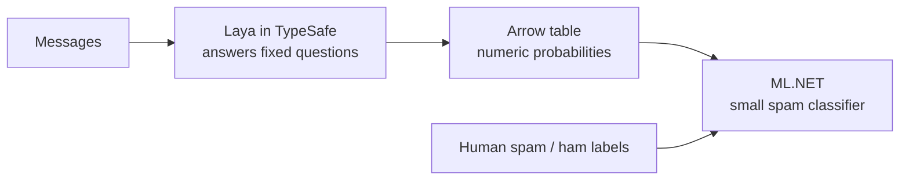

# Learn a small classifier from answers to questions

**Goal:** learn a small spam classifier from a table of numeric answers to fixed
questions about messages. Instead of giving the classifier only words, we can
give it observations such as "how likely is this a commercial solicitation?"

There are two separate jobs. **Laya produces the question-answer probabilities
in the [TypeSafe producer](https://github.com/luisquintanilla/typesafe-meai).
ML.NET learns a predictor from that saved table here.** ML.NET does **not**
generate the semantic features in this sample.



Labels join the table by message ID for training. **Labels are never sent to
Laya.** Arrow is the file/table format connecting the two jobs, not a model.

## 1. See what becomes a feature

Imagine the fictional message: **"Sale ends tonight. Reply DEAL for a discount."**
The numbers below are **invented for explanation**: they are not measured model
output, fixture values, a spam prediction or study results.

| ML.NET feature slot | Named probability | Illustrative value |
|---:|---|---:|
| 0 | `commercial_solicitation` (true) | 0.85 |
| 1 | `requested_contact_action` (true) | 0.90 |
| 2 | `time_pressure[0]` (none) | 0.10 |
| 3 | `time_pressure[1]` (mild) | 0.25 |
| 4 | `time_pressure[2]` (explicit urgent deadline) | 0.65 |
| 5 | `message_purpose[0]` (personal) | 0.05 |
| 6 | `message_purpose[1]` (service notice) | 0.10 |
| 7 | `message_purpose[2]` (promotion) | 0.70 |
| 8 | `message_purpose[3]` (financial offer) | 0.10 |
| 9 | `message_purpose[4]` (other) | 0.05 |

Two Binary questions contribute one `P(true)` each. The Score question contributes
all three level probabilities; the Choice question contributes all five purpose
probabilities. **2 + 3 + 5 = ten features**, not ten selected answers.

A fifth question, `spam_baseline`, might have an illustrative value of 0.75.
It is kept **outside** this vector: it is a separate direct-spam baseline, not
an input to the semantic classifier. Training labels are also outside the vector.

[`ArrowFeatureReader.Project`](ArrowFeatureReader.cs) reads these coordinates in
the frozen order. [`FeatureContract.ConvertProbabilities`](FeatureContract.cs)
checks them and converts Arrow's stored `double` values to ML.NET `float` values.
It does not change the Arrow file or normalize the probabilities again.

## 2. Try the offline table-reading route first

Use PowerShell 7 and the .NET 10 SDK from the repository root. You need **one
local artifact-kit folder** supplied by the experiment producer: it contains the
pinned Arrow/decision-adapter package feeds and their receipts. It is **not**
a model or SMS corpus. These experimental packages are not published on public
NuGet; the kit is a genuine prerequisite, not something this sample invents.

```powershell
.\samples\DecisionArrowPredictor\Start.ps1 -ArtifactRoot "C:\path\decision-arrow-kit"
```

That single command verifies the kit, restores the sample's pinned dependencies,
builds it, and runs `smoke` on the checked-in authoritative synthetic Arrow fixture.
There is **no model call, corpus acquisition or classifier training**. An initial
restore may fetch ordinary .NET dependencies from NuGet; it never downloads a
model or messages. A missing/incomplete kit fails with a prerequisite error.

The important output is:

```text
Synthetic-only Arrow smoke: 257 validated rows, HighPrecision; no inference or downloads.
Read 257 synthetic rows as ten numeric features plus a separate direct baseline.
No classifier was trained; no accuracy or generalization result was measured.
```

You have demonstrated that the consumer can validate and read a completed
five-question Arrow table, including its final short batch, with the expected
feature identity. **You have not demonstrated that Laya's answers are correct
or that a trained spam classifier works.** The fictional table above illustrates
the mapping; the smoke uses the producer's separate, fixed synthetic values.

Already have the sample built? Its `smoke` command repeats just that read.
The exact kit layout and advanced setup are in the
[experiment reference](EXPERIMENT.md#artifact-kit-and-offline-start).

## 3. Follow the small ML.NET learning step

Inspect [`LearningRow` and `PredictorTraining.Fit`](PredictorTraining.cs).
Each row has `Semantic` (the ten floats), `Text` (the original message) and
`Label` (the human spam/ham label), plus IDs for joining and duplicate groups.

The semantic arm already has numeric features, so it just names their column:

```csharp
context.Transforms.CopyColumns("Features", nameof(LearningRow.Semantic))
```

The text-only arm instead turns training messages into a numeric text vector:

```csharp
context.Transforms.Text.FeaturizeText("Features", nameof(LearningRow.Text))
```

The combined arm concatenates those text features and the ten semantic floats.
All three use the same SDCA logistic-regression learner. These excerpts from
`Fit` show the key operations; the full method owns the declared tuning settings:

```csharp
var view = context.Data.LoadFromEnumerable(training);

estimator = estimator.Append(
    context.BinaryClassification.Trainers.SdcaLogisticRegression(
        new SdcaLogisticRegressionBinaryTrainer.Options
        {
            LabelColumnName = nameof(LearningRow.Label),
            FeatureColumnName = "Features",
            L2Regularization = (float)l2,
            MaximumNumberOfIterations = MaxIterations,
            NumberOfThreads = 1
        }));

var fitted = estimator.Fit(view);
```

**`Fit` learns from training rows and their labels.** Text vocabulary is fitted
on those same training rows, not on validation or holdout messages.
[`PredictorTraining.Predict`](PredictorTraining.cs) then applies the fitted model:

```csharp
model.Transform(ml.Data.LoadFromEnumerable(rows))
```

The scored rows contain a `Probability` for spam. The real study selects models
and thresholds using validation rows, then evaluates untouched holdout rows;
[`StudyWorkflow`](StudyWorkflow.cs) coordinates that sequence. Ordinary ML.NET
models are saved/loaded separately from the decision assets.

For a **new message**, the semantic or combined classifier still needs Laya's
ten question probabilities first. Learning a small head does **not** remove
semantic extraction. The text-only arm does not require those probabilities.

## Run the real experiment later

The frozen real study compares a training-prevalence prior, direct spam
probability, text, semantic and combined classifiers. **The real scalar study is
complete**; see [its results and limitations](EXPERIMENT.md#real-scalar-study-results).
The offline route above is not that training run or predictive evidence.

Continue with [the experiment reference](EXPERIMENT.md#completed-real-data-commands)
for real-data prerequisites and commands. Acquisition/license evidence, grouped
splits, exact package/feature contracts, metrics and test evidence live there,
not on the beginner path.
