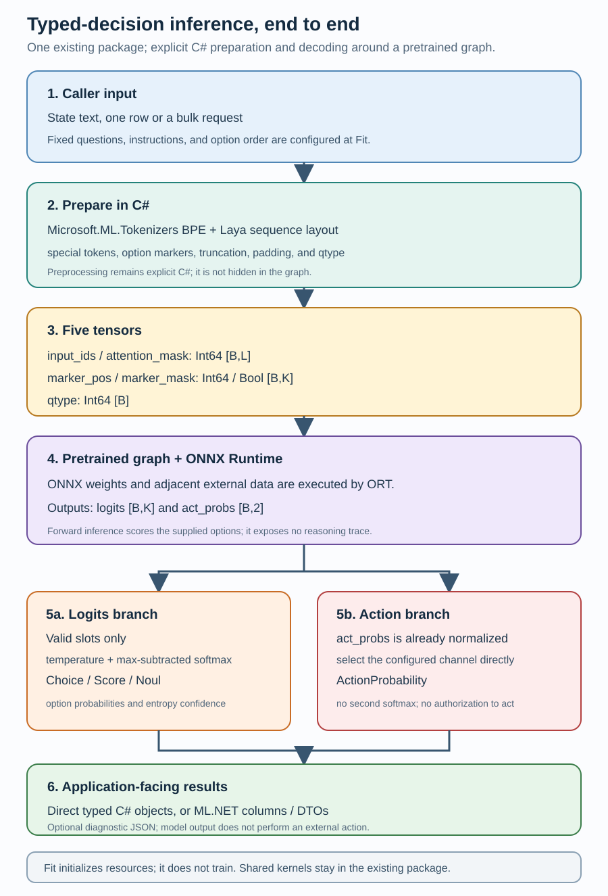
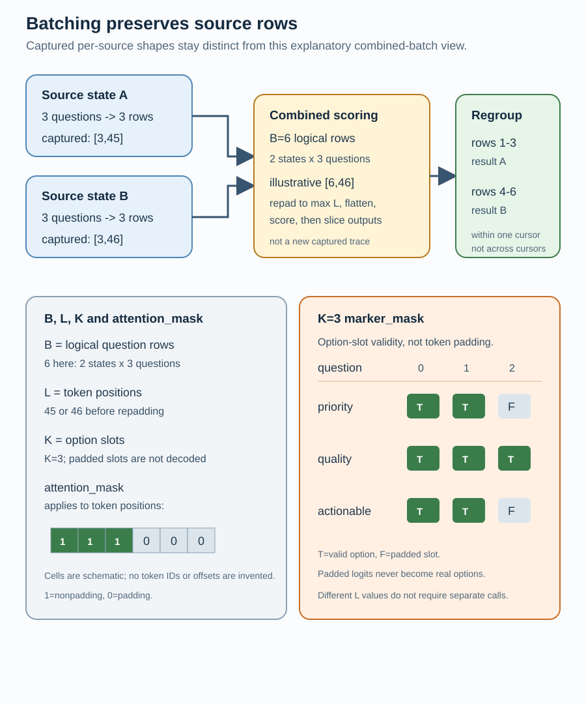
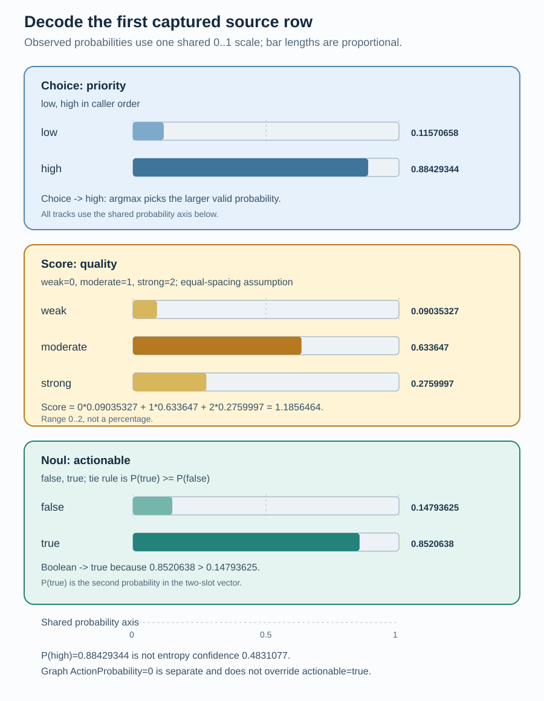

# ML.NET typed decisions

This file-based .NET 10 sample is the primary entry point for typed-decision
inference. It uses the existing `MLNet.TextInference.Onnx` package. `Fit`
validates the `IDataView` schema and opens local model assets, but does not
train the ONNX model.

## Inputs

The two `State` rows are:

```text
The customer supplied reproducible steps and requested an urgent fix.
The report is missing logs and has no clear requested action.
```

The configured questions are:

```csharp
using MLNet.TextInference.TypedDecisions;
using static MLNet.TextInference.TypedDecisions.DecisionQuestion;

var questions = new[]
{
    Choice("priority", "How urgent is the request?", new[] { "low", "high" }),
    Score("quality", "How strong is the evidence?",
        new[] { "weak", "moderate", "strong" }),
    Noul("actionable", "Can the request be acted on now?")
};
```

State is text. If the caller needs JSON state, it serializes that JSON before
putting it in the `State` column. The model scores the supplied alternatives;
it does not generate prose or apply business rules.

## Local model-directory setup

Inference has no implicit network access. Point `ModelAssetsPath` (or the
sample's `--model-assets` option) at a directory such as:

```text
models/laya-english-fp32/
  laya.onnx
  laya.onnx.data
  laya_config.json
  tokenizer/tokenizer.json
  tokenizer/tokenizer_config.json
```

An optional versioned ZIP archive with a manifest is also accepted. A
directory does not require a generated manifest. The graph's external data
must remain adjacent to the graph. The sample targets the public
`receptron/laya-onnx` English FP32 revision
`68f27dfe5a27a54fb2b1fefc432f43f972e90868`; assets are deliberately not
committed.

## Results at a glance

These are the exact decoded values for the two fixed sample states used by
the captured runs:

| Sample input | Priority | Quality score | Actionable | P(true) |
|---|---|---:|---|---:|
| Reproducible steps, urgent fix | high | 1.1856464 | true | 0.8520638 |
| Missing logs, no clear action | low | 0.61998236 | false | 0.10274245 |

`Reproducible steps, urgent fix` abbreviates the full state
`The customer supplied reproducible steps and requested an urgent fix.`.
`Missing logs, no clear action` abbreviates
`The report is missing logs and has no clear requested action.`. The values
are from the pinned local capture described in
[Captured outputs](#captured-outputs); `quality` is a three-level zero-based
Score with range `0..2`, not a percentage, so `1.1856464` is an expected
ordinal index rather than a percent. These are not universal business truth.

## Eleven modes

All commands use portable JIT execution (`PublishAot=false`):

```powershell
# Direct convenience API on the fitted transformer
dotnet run --file samples/TypedDecisions/MLNetPipeline/Program.cs -- `
  --mode direct --model-assets .\models\laya-english-fp32

# Recommended: lazy IDataView facade with cursor batching
dotnet run --file samples/TypedDecisions/MLNetPipeline/Program.cs -- `
  --mode facade --model-assets .\models\laya-english-fp32

# Native single-row PredictionEngine mapping
dotnet run --file samples/TypedDecisions/MLNetPipeline/Program.cs -- `
  --mode prediction-engine --model-assets .\models\laya-english-fp32

# PredictionEngine over the explicit native stages
dotnet run --file samples/TypedDecisions/MLNetPipeline/Program.cs -- `
  --mode prediction-engine-stages --model-assets .\models\laya-english-fp32

# PredictionEngine over an append-composed facade
dotnet run --file samples/TypedDecisions/MLNetPipeline/Program.cs -- `
  --mode prediction-engine-composed --model-assets .\models\laya-english-fp32

# Preparation -> scoring -> decoding stages
dotnet run --file samples/TypedDecisions/MLNetPipeline/Program.cs -- `
  --mode stages --model-assets .\models\laya-english-fp32

# Two append-composed facade applications
dotnet run --file samples/TypedDecisions/MLNetPipeline/Program.cs -- `
  --mode composed --model-assets .\models\laya-english-fp32
```

The program accepts `--bundle` as a compatibility alias for
`--model-assets`, but the value can be an ordinary model directory and need
not be a bundle archive.

The direct API uses the same kernels and asset contract as the facade; each
fitted transformer instance reuses its own initialized resources:

```csharp
using MLNet.TextInference.Onnx;
using MLNet.TextInference.TypedDecisions;

using var transformer = ml.Transforms.OnnxTypedDecisions(options).Fit(data);
DecisionResponse one = transformer.Infer(state);
IReadOnlyList<DecisionResponse> many = transformer.Infer(states);
```

`Infer(states)` is the bulk form and can batch states internally. `direct` is
therefore a straightforward call-oriented API; the ML.NET facade and stages
are useful when the application already has a schema-aware, composable,
lazy-`IDataView` pipeline. ML.NET is not presented here as an exclusive
batching feature, an automatic speedup, or a source of better accuracy.

## Beginner and developer walkthrough

This section starts with the mental model, then follows one request through
the implementation. The links point to the source that owns each part of the
contract.

### 1. What this decision model does

A decision model is a learned scorer for alternatives supplied by the caller.
For each `State`, the application supplies instructions and a fixed set of
options, and the ONNX graph scores those alternatives. It is **not** a
free-form text generator, a collection of hand-written business rules, or an
agent that executes an action.

The three question types express different meanings:

- **Choice** returns one label, such as `low` or `high`, by taking the
  largest option probability. The caller's label order is significant.
- **Score** returns the expected zero-based option index. This sample's
  `weak`, `moderate`, and `strong` levels are rendered as `level 0: weak`,
  `level 1: moderate`, and `level 2: strong`; the arithmetic assumes those
  indices are equally spaced. Its three-level range is `0..2`, not a
  percentage.
- **Noul** is this API's name for a Boolean question. It compares exactly two
  explicit criteria rendered as
  `false: no, the statement does not hold` and
  `true: yes, the statement holds` by default. A caller can provide
  `NoulCriteria` to replace those two texts. It returns true on a tie
  (`P(true) >= P(false)`), and exposes `P(true)` separately.

The question IDs, instructions, option order, and resulting typed output
columns are configured when the transformer is fitted. `State` is the
per-row text that varies at inference time. There is no dynamic per-row
question schema: every row in this sample uses the same three questions.
Serializing JSON into `State` is an application choice; this package does not
provide an implicit Python-compatible object serializer.

### 2. The pipeline in one picture



*Figure 1. The conceptual flow: the logits path decodes valid options into
typed decisions, while the already-normalized action head remains a separate
diagnostic channel. [Open the full-size editable SVG](images/pipeline-overview.svg).*

ONNX is the exported computation/model format; ONNX Runtime is the execution
engine that evaluates it. In this implementation, preprocessing and
postprocessing remain explicit C# code around the graph. They are not
automatically embedded into the ONNX file or exported as a whole ML.NET
pipeline.

The direct, facade, and explicit-stage surfaces share the same kernels and
asset contract. A fitted facade initializes and owns its tokenizer, ONNX
session, profile, and decoder resources; `Infer` and `Transform` on that
facade share the instance. Separately fitted explicit stages initialize only
the resources required by their stage, while separately fitted composed
pipelines create their own instances. A useful way to remember the stages is:

1. **Prepare** converts caller text and the fixed question contract into the
   graph's five inputs.
2. **Score** executes the graph with ONNX Runtime.
3. **Decode** turns graph outputs into Choice, Score, and Noul results.
4. **Map** exposes those results as ML.NET columns or DTO properties.

### 3. Load trusted local assets; `Fit` is initialization, not training

The sample points at a local directory or a versioned archive containing
`laya.onnx`, its adjacent `laya.onnx.data` external weights, Laya profile
configuration, and the tokenizer directory. Bundle validation keeps paths
relative to the bundle root, preserves external-data locations, and checks
declared file hashes. ZIP extraction rejects entries that escape the
destination. Inference never downloads missing assets or silently chooses a
different revision. See
[TypedDecisionBundle.cs](../../../src/MLNet.TextInference.Onnx/TypedDecisions/TypedDecisionBundle.cs)
and [AssetArchive.cs](../../../src/MLNet.TextInference.Onnx/AssetArchive.cs).

`Fit` validates the input schema and initializes reusable tokenizer, ONNX
session, profile, and decoder resources. It does not train or fine-tune the
ONNX graph. The profile's `max_len`, `head_max_len`, special-token metadata,
and temperature policy must match the weights and tokenizer that produced the
export. Mixing a tokenizer or configuration from another model can change
token IDs and sequence layout even when the files look superficially similar.

This is the existing `MLNet.TextInference.Onnx` package and assembly. The
direct mode is another surface over the same fitted ML.NET transformer; it is
not a dependency-free standalone package or a second public core API.

### 4. Token IDs are not words

The selected Laya asset is a Hugging Face BPE (byte-pair encoding) tokenizer.
BPE splits text into
model-specific subword pieces and maps pieces to integer IDs; an ID is not
necessarily a whole word, and the IDs have meaning only with this vocabulary
and merge table. The implementation adapts that asset through
`BpeOptions`/`BpeTokenizer` from `Microsoft.ML.Tokenizers`, rather than using
another tokenizer runtime. It reads vocabulary, merges, special tokens, and
added-token metadata from `tokenizer.json` and `tokenizer_config.json`,
preserves the profile's byte-level and supported NFC/lowercase normalization
behavior, and rejects unsupported configurations instead of approximating
them. Encoding explicitly considers the configured pre-tokenization and
normalization. See
[HuggingFaceBpeTokenizerLoader.cs](../../../src/MLNet.TextInference.Onnx/HuggingFaceBpeTokenizerLoader.cs),
[TokenizerEncoding.cs](../../../src/MLNet.TextInference.Onnx/TokenizerEncoding.cs),
and [LayaTokenizer.cs](../../../src/MLNet.TextInference.Onnx/TypedDecisions/LayaTokenizer.cs).

The official [.NET tokenizer guidance](https://learn.microsoft.com/en-us/dotnet/ai/how-to/use-tokenizers)
also explains why a model's vocabulary and merges must stay paired with its
tokenizer instance. Its examples are not interchangeable with the Laya
assets used here.

### 5. Build one Laya sequence per state-question pair

`PrepareDecisionInputs` creates a separate prepared sequence for every
question for every state. With two states and three configured questions, a
direct multi-state request has six logical flattened rows. The sequence
construction is profile-specific:

1. Render options in caller order. Choice renders each label, or
   `label: description` when a description is supplied; this sample uses
   labels alone. Score renders `level {index}: {level}`; Noul renders its two
   explicit `false` and `true` criteria.
2. Scrub the configured mask-token literal from instructions, options, and
   state so a caller cannot accidentally create an extra marker. The guide
   writes that configured token schematically as `[MASK]`; it is not a
   hardcoded assumption about every tokenizer asset.
3. Encode each option as a separate chunk with a literal leading space before
   BPE, prefix the option tokens with the configured mask-token ID, and record
   `marker_pos` at that prepended MASK position. It points to the MASK slot,
   not to the option label text.
4. Encode the question head separately as
   `{choice|score|noul} question: {instructions}`.
5. Explicitly assemble the final special-token layout:
   `[CLS] + question head + [SEP] + option sequences + [SEP] + state + [SEP]`.
6. Allocate bounded option/head space from `head_max_len`. When option
   material is too large, preparation bounds the option encodings, then gives
   the remaining `max_len` room to the state. The state is truncated to that
   remaining room; there is no automatic chunking, so a long state tail can be
   lost. Marker/option alignment is validated and marker loss is rejected
   rather than silently decoding the wrong option.
7. Pad rows to the maximum sequence length in the prepared batch with the
   configured pad token. In this guide `[CLS]`, `[SEP]`, `[MASK]`, and
   `[PAD]` are schematic names for the profile's configured token strings and
   IDs loaded from the tokenizer metadata; they are not universal numeric
   constants. The worked trace below records the pinned profile's actual IDs.

The layout and special-token contract live in
[PrepareDecisionInputs.cs](../../../src/MLNet.TextInference.Onnx/TypedDecisions/PrepareDecisionInputs.cs).
This is why replacing the tokenizer with a generic GPT/Tiktoken example would
not be equivalent.

### 5a. Follow one source row across stage boundaries


*Figure 2. A boundary-by-boundary trace for the first `State` value and its
three configured questions. Green cards are source-backed evidence; the
hatched card is a complete tiny fixture used only to show decoder mechanics.
[Open the full-size editable SVG](images/stage-io-trace.svg).*

This graphic combines two evidence sets rather than implying a new end-to-end
run:

- **Preparation rerun:** only the pinned tokenizer files
  (`tokenizer.json`, `tokenizer_config.json`) and `laya_config.json` were
  downloaded from the English FP32 Laya revision. No weights were downloaded
  and no graph was executed. The public `PrepareDecisionInputs` stage
  reproduced the first source row as `B=3`, `L=45`, `K=3`, with 135 flattened
  ID positions, `marker_pos` rows `[11,13]`, `[11,16,21]`, `[14,24]`,
  `qtype=[0,1,2]`, and nonpadding counts `[28,39,45]`. Their sum is
  `input_tokens=112`; it is not the padded array length.
- **Earlier inference capture:** the retained graph outputs were `logits [3,3]`
  (9 float values) and `act_probs [3,2]` (6 float values) **per source after
  regrouping**, followed by the exact decoded probabilities and typed results
  already shown in [Captured outputs](#captured-outputs). If scored alone,
  this source uses an ORT input of `[3,45]`; a cursor combining two source
  rows may repad a forward call to `[6,46]`. Raw logits and every action-head
  channel were not retained, so this guide does not reconstruct them from
  normalized probabilities.

For this sample, `RenderOptions()` produces `low`, `high`; `level 0: weak`,
`level 1: moderate`, `level 2: strong`; and the exact Noul strings
`false: no, the statement does not hold` and
`true: yes, the statement holds`. The public preparation surface below is a
fragment; `data` and `ml` are the sample's existing `IDataView` and
`MLContext`, and the fitted transformer must remain alive while `prepared` is
consumed:

```csharp
using var preparationTransformer = ml.Transforms.PrepareDecisionInputs(
        new DecisionInputPreparationOptions
        {
            ModelAssetsPath = modelAssetsPath,
            Questions = questions
        })
    .Fit(data);
var prepared = preparationTransformer.Transform(data);
```

For the first source row, the preparation columns/subset (not a full
scored-and-decoded result DTO) are:

```text
DecisionBatchSize       = 3
DecisionSequenceLength = 45
DecisionMarkerWidth    = 3
DecisionInputIds        = VBuffer<long> length 135
DecisionAttentionMask   = VBuffer<long> length 135
DecisionMarkerPositions = VBuffer<long> length 9
DecisionMarkerMask      = VBuffer<bool> length 9
DecisionQuestionTypes   = VBuffer<long> values [0, 1, 2]

first 15 DecisionInputIds =
  [50281, 22122, 1953, 27, 1359, 21007, 310, 253,
   2748, 32, 50282, 50284, 1698, 50284, 1029]
marker positions by question =
  priority [11, 13]; quality [11, 16, 21]; actionable [14, 24]
marker mask by question =
  priority [true, true, false];
  quality [true, true, true];
  actionable [true, true, false]
```

<details>
<summary>All five prepared tensors as shaped JSON from the tokenizer-only rerun</summary>

```json
{
  "input_ids": [
    [
      50281, 22122, 1953, 27, 1359, 21007, 310, 253, 2748, 32, 50282, 50284, 1698, 50284, 1029,
      50282, 510, 7731, 12164, 41374, 5018, 285, 9521, 271, 21007, 4993, 15, 50282, 50283, 50283,
      50283, 50283, 50283, 50283, 50283, 50283, 50283, 50283, 50283, 50283, 50283, 50283, 50283, 50283, 50283
    ],
    [
      50281, 18891, 1953, 27, 1359, 2266, 310, 253, 1941, 32, 50282, 50284, 1268, 470, 27,
      5075, 50284, 1268, 337, 27, 10290, 50284, 1268, 374, 27, 2266, 50282, 510, 7731, 12164,
      41374, 5018, 285, 9521, 271, 21007, 4993, 15, 50282, 50283, 50283, 50283, 50283, 50283, 50283
    ],
    [
      50281, 79, 3941, 1953, 27, 2615, 253, 2748, 320, 14001, 327, 1024, 32, 50282, 50284,
      3221, 27, 642, 13, 253, 3908, 1057, 417, 2186, 50284, 2032, 27, 4754, 13, 253,
      3908, 6556, 50282, 510, 7731, 12164, 41374, 5018, 285, 9521, 271, 21007, 4993, 15, 50282
    ]
  ],
  "attention_mask": [
    [
      1, 1, 1, 1, 1, 1, 1, 1, 1, 1, 1, 1, 1, 1, 1,
      1, 1, 1, 1, 1, 1, 1, 1, 1, 1, 1, 1, 1, 0, 0,
      0, 0, 0, 0, 0, 0, 0, 0, 0, 0, 0, 0, 0, 0, 0
    ],
    [
      1, 1, 1, 1, 1, 1, 1, 1, 1, 1, 1, 1, 1, 1, 1,
      1, 1, 1, 1, 1, 1, 1, 1, 1, 1, 1, 1, 1, 1, 1,
      1, 1, 1, 1, 1, 1, 1, 1, 1, 0, 0, 0, 0, 0, 0
    ],
    [
      1, 1, 1, 1, 1, 1, 1, 1, 1, 1, 1, 1, 1, 1, 1,
      1, 1, 1, 1, 1, 1, 1, 1, 1, 1, 1, 1, 1, 1, 1,
      1, 1, 1, 1, 1, 1, 1, 1, 1, 1, 1, 1, 1, 1, 1
    ]
  ],
  "marker_pos": [
    [11, 13, 0],
    [11, 16, 21],
    [14, 24, 0]
  ],
  "marker_mask": [
    [true, true, false],
    [true, true, true],
    [true, true, false]
  ],
  "qtype": [0, 1, 2]
}
```

Each `input_ids` and `attention_mask` row has 45 values. The padded
`marker_pos` zeros are storage for the unused K=3 slots; the corresponding
`marker_mask=false` entries exclude them. The first attention row has 28 ones
and 17 zeros, while its two valid option slots are selected independently by
`marker_mask=[true,true,false]`.
</details>

The pinned tokenizer vocabulary maps the most useful first-row positions as
follows:

| Position | ID | Pinned tokenizer piece / meaning |
|---:|---:|---|
| 0 | 50281 | `[CLS]` |
| 1 | 22122 | `choice` |
| 2 | 1953 | `Ġquestion` (`Ġ` is the byte-level space marker) |
| 3 | 27 | `:` |
| 4-9 | 1359, 21007, 310, 253, 2748, 32 | `ĠHow Ġurgent Ġis Ġthe Ġrequest ?` |
| 10 | 50282 | `[SEP]` |
| 11 | 50284 | `[MASK]` before `low` |
| 12 | 1698 | `Ġlow` |
| 13 | 50284 | `[MASK]` before `high` |
| 14 | 1029 | `Ġhigh` |
| 15 | 50282 | `[SEP]` |
| 16 | 510 | `The` (start of the state) |
| 28+ | 50283 | `[PAD]` (padding begins after the first row's 28 attention ones) |

These pieces were looked up in the pinned tokenizer vocabulary; they are not
inferred from the decoded probabilities. The public preparation stage emits
IDs and offsets, not a token-string column. The five ML.NET vectors are flat
`VBuffer<T>` values plus the three scalar dimension columns. The scorer uses
those dimensions to wrap equivalent ORT shapes: `input_ids` and
`attention_mask` become `Int64 [3,45]`, `marker_pos` and `marker_mask` become
`[3,3]`, and `qtype` becomes `Int64 [3]`. This is a representation boundary,
not a second tokenizer or a universal `Tensor<T>` layer.

The first priority row's rendered text view is:

```text
[CLS] choice question: How urgent is the request? [SEP]
[MASK] low [MASK] high [SEP]
The customer supplied reproducible steps and requested an urgent fix. [SEP]
```

The implementation encodes the question head, each option, and the state as
separate chunks, then assembles them around the configured special-token
markers; a single `EncodeToIds` call over the displayed sentence is not
guaranteed to produce the same IDs because byte-level BPE boundaries, the
leading option space, and the inserted MASK IDs are part of the contract. The
table maps the selected real IDs from that assembled row, including the two
valid priority markers at positions 11 and 13.

For the missing raw-score arithmetic, the hatched lane uses an explicitly
illustrative fixture, not a model output:

```text
valid marker_mask = [true, true, false]
illustrative logits = [0.4, 1.2, 0.0]
valid-only logits = [0.4, 1.2]       # slot 2 is excluded, not zeroed
temperature T = 1.0                  # illustrative, not the pinned profile values
m = 1.2
exp(0.4 - m) = 0.4493; exp(1.2 - m) = 1
sum = 1.4493
softmax = [0.4493 / 1.4493, 1 / 1.4493] ~= [0.3100, 0.6900]
illustrative act_probs = [0.25, 0.75] -> select configured channel 0.75
```

The real first-row decoder output is the separate captured result:
`priority` probabilities `[0.11570658, 0.88429344]` select `"high"`;
`quality` probabilities `[0.09035327, 0.633647, 0.2759997]` produce
`1.1856464` on the `0..2` Score range; and `actionable` probabilities
`[0.14793625, 0.8520638]` produce `true`. Direct `Infer` returns a
`DecisionResponse` with typed `DecisionResult` records and
`InputTokenCount=112`; facade/stage paths expose properties such as
`Decision_priority_PredictedLabel`, `Decision_quality_Score`,
`Decision_actionable_PredictedLabel`, and
`Decision_actionable_Probability`, plus optional `DecisionResults` diagnostic
JSON. `ActionProbability=0` remains the separate graph head and does not
override the Boolean result. `DecisionRequest` and `DecisionInputBatch` are internal
implementation types, not public caller records.

In a debugger, the direct response and its native-column projection look like
this:

```text
DecisionResponse.Results[0] = ChoiceDecisionResult
  Choice = "high"
  -> Decision_priority_PredictedLabel = "high"

DecisionResponse.Results[1] = ScoreDecisionResult
  Score = 1.1856464
  -> Decision_quality_Score = 1.1856464

DecisionResponse.Results[2] = NoulDecisionResult
  Value = true; ProbabilityTrue = 0.8520638
  -> Decision_actionable_PredictedLabel = true
  -> Decision_actionable_Probability = 0.8520638
```

| Direct property | Value | Native output column |
|---|---:|---|
| `ChoiceDecisionResult.Choice` | `"high"` | `Decision_priority_PredictedLabel` |
| `ScoreDecisionResult.Score` | `1.1856464` | `Decision_quality_Score` |
| `NoulDecisionResult.Value` | `true` | `Decision_actionable_PredictedLabel` |
| `NoulDecisionResult.ProbabilityTrue` | `0.8520638` | `Decision_actionable_Probability` |

### 6. Understand `B`, `L`, `K`, padding, and the five inputs

A tensor is a numeric grid with declared dimensions. For example,
`[3,45]` contains `3*45=135` positions. ML.NET stage columns carry flat
`VBuffer` values plus scalar dimension columns such as
`DecisionBatchSize` and `DecisionSequenceLength`; the scorer uses those
dimensions when it wraps the flat values for ONNX Runtime's native shaped
inputs. The ML.NET representation is therefore not the same thing as an ORT
tensor object.



*Figure 3. Source rows are prepared per state, can be repadded and combined
within a cursor, then are sliced back to their source rows. The combined
`[6,46]` is an explanatory illustration, not a replacement for the captured
per-source shapes. [Open the full-size editable SVG](images/batching-and-masks.svg).*

The graph inputs are:

| Input | Type and shape | Meaning |
|---|---|---|
| `input_ids` | `Int64 [B,L]` | Padded BPE token IDs for each prepared sequence. |
| `attention_mask` | `Int64 [B,L]` | `1` for nonpadding sequence positions and `0` for padding. |
| `marker_pos` | `Int64 [B,K]` | Positions of option `[MASK]` markers. |
| `marker_mask` | `Bool [B,K]` | Which marker positions are real options rather than padding. |
| `qtype` | `Int64 [B]` | Question type: Choice `0`, Score `1`, Noul `2`. |

`B` is a flattened question-row count, `L` is the padded sequence length,
and `K` is the maximum option/marker width. Choice and Noul have two valid
markers plus one padded slot when `K=3`; Score has three valid markers.
`marker_mask`, not a zero-valued position, determines validity. For the
sample, each source state produces a per-source prepared row with `B=3`.
The captured lengths are `3*45=135` and `3*46=138`, and the aggregate
nonpadding counts are `input_tokens=112` and `input_tokens=115`; those counts
are not the padded `B*L` lengths.

The explicit native stage prints those per-source shapes. The scorer can
combine multiple prepared source rows by repadding them to the batch's
maximum `L` and `K`, flattening them for one ORT call, then slicing the
outputs back to each source row. Therefore `3*45` and `3*46` describe the
individual prepared rows; different `L` values do not by themselves require
separate model calls. See
[TypedDecisionDataViews.cs](../../../src/MLNet.TextInference.Onnx/TypedDecisions/TypedDecisionDataViews.cs).

### 7. Run the graph, then decode only valid options



*Figure 4. The first captured source row, decoded with one shared probability
scale. The bars show observed probabilities, not invented logits. See
[Captured outputs](#captured-outputs) for the pinned model/runtime context.
The confidence and action-probability caveats are called out separately.
[Open the full-size editable SVG](images/decision-decoding.svg).*

The graph's `logits` are unnormalized learned scores, not probabilities.
Forward inference applies the trained weights to the whole prepared context
and scores the supplied options; it does not expose a reasoning trace, and
this guide does not name an unverified backbone.

The custom scorer binds the five named inputs and validates actual element
types and output shapes before decoding. It preserves adjacent ONNX external
data and expects:

- `logits` with shape `[B,K]`, containing one score per marker slot;
- `act_probs` with shape `[B,2]`, already softmaxed by the graph.

For logits, the decoder applies the profile temperature policy, clamps valid
temperatures to `[0.5, 5.0]`, subtracts the maximum valid logit, exponentiates,
and divides by the sum. The resulting softmax values are nonnegative and sum
to one over the valid choices. Subtracting the maximum preserves the
probability ratios while reducing overflow risk. A temperature below `1`
sharpens the distribution; a temperature above `1` flattens it. This is
decoding, not training or an accuracy-calibration claim. It runs only over
valid options: an invalid slot must be excluded, not assigned logit `0`,
because `exp(0)` would still add probability mass. `act_probs` is already a
probability vector, so it is read directly and must not be softmaxed again.

The scorer uses ONNX Runtime for model execution. It wraps the prepared
`long` and `bool` arrays with `OrtValue.CreateTensorValueFromMemory` and the
declared dimensions. In this decision decoder, `System.Numerics.Tensors` is
used only by the shared stable-softmax helper after `MathF.Exp`;
`TensorPrimitives.Sum` performs the reduction and `TensorPrimitives.Divide`
performs element-wise normalization. This is not a
replacement inference engine, a universal `Tensor<T>` wrapper, or an
end-to-end zero-copy guarantee.

The implementation is in
[ScoreOnnxDecisionModel.cs](../../../src/MLNet.TextInference.Onnx/TypedDecisions/ScoreOnnxDecisionModel.cs),
[DecodeDecisions.cs](../../../src/MLNet.TextInference.Onnx/TypedDecisions/DecodeDecisions.cs),
and [StableSoftmax.cs](../../../src/MLNet.TextInference.Onnx/Numerics/StableSoftmax.cs).
The [ONNX Runtime C# guide](https://onnxruntime.ai/docs/get-started/with-csharp.html)
provides the general session/inference background; this scorer adds the
Laya-specific input and output contract described above.

The decoded values follow the question semantics:

- **Choice:** row 1 has `high` because `0.88429344` is larger than
  `0.11570658`; row 2 has `low` because `0.9197405` is larger than
  `0.08025956`.
- **Score:** the first row is
  `0*0.09035327 + 1*0.633647 + 2*0.2759997 = 1.1856464`, and the second
  is `0*0.42993295 + 1*0.5201518 + 2*0.049915284 = 0.61998236`.
  This is an expected ordinal index under the equal-spacing assumption, not
  a claim that the distance from `weak` to `moderate` equals the distance
  from `moderate` to `strong` in the real world.
- **Noul:** `P(true)` is the second value in `[false, true]`. The Boolean
  result is true when `P(true) >= P(false)`.

Confidence is a normalized concentration measure, not the winning
probability, accuracy, or empirical calibration:

```text
H(p) = -sum(p * ln(p))
confidence = 1 - H(p) / ln(valid option count)
```

Entropy approaches its maximum for a uniform distribution, so confidence
approaches `0`; it approaches `1` when probability is concentrated. For
example, row 1 `priority` has winning probability `0.88429344` but confidence
`0.4831077`. The separate `action_probability` comes from the graph's
configured action head. A captured zero does not mean `actionable=false`, does
not override the Noul result, and is not explained here beyond what the graph
returned.

### 8. Map results into ML.NET columns and DTOs

Direct `Infer` returns typed C# `DecisionResponse` objects; it does not
materialize an `IDataView` or ML.NET columns on every call. The facade and
stage paths produce typed columns named from the configured question IDs:
Choice gets a text label and probabilities, Score gets a float score and
probabilities, and Noul gets a Boolean plus `P(true)`. All questions also
expose confidence and the separate action probability. Probability vectors
carry `SlotNames` metadata. `DecisionResults` is optional diagnostic JSON
containing the complete response; it is not the transport format between
native stages.

The direct call, facade, and stage chain use the same kernels and asset
contract, but each separately fitted transformer owns its own resources:

```csharp
// Non-standalone fragment from samples/TypedDecisions/MLNetPipeline/Program.cs.
// `prepared`, `scored`, `decoded`, `ml`, and `data` are defined earlier there.
var stages = ml.Transforms.PrepareDecisionInputs(prepared)
    .Append(ml.Transforms.ScoreOnnxDecisionModel(scored))
    .Append(ml.Transforms.DecodeDecisions(decoded));
var stageTransformer = stages.Fit(data);
```

The public extension methods are declared in
[MLContextExtensions.cs](../../../src/MLNet.TextInference.Onnx/MLContextExtensions.cs).
The facade and typed stage mapping are implemented in
[TypedDecisionEstimators.cs](../../../src/MLNet.TextInference.Onnx/TypedDecisions/TypedDecisionEstimators.cs)
and [TypedDecisionRowMappers.cs](../../../src/MLNet.TextInference.Onnx/TypedDecisions/TypedDecisionRowMappers.cs).

### 9. Choose an execution mode

All eleven sample modes use the same questions, states, assets, and fitted
package surface:

1. **`direct`** calls `transformer.Infer` and prints JSON response objects.
2. **`facade`** calls `Transform` and enumerates a lazy `IDataView`, exposing
   typed columns plus diagnostic JSON.
3. **`stages`** exposes preparation/scoring tensors and decoded columns so
   intermediate dimensions can be inspected.
4. **`composed`** appends a second independent typed-decision facade with
   `AppendedDecision_` names.
5. **`prediction-engine`** reads the facade through a conventional
   single-row DTO mapper.
6. **`prediction-engine-stages`** reads the explicit stages through that
   single-row mapper.
7. **`prediction-engine-composed`** reads both independent facade outputs
   through one DTO.
8. **`portable-writer`** fits the facade, writes a portable typed-decision
   archive, and prints the fitted output. It requires both
   `--model-assets` and `--portable-path`.
9. **`portable-reader`** loads that archive in the current process and
   materializes the same output without `Fit` or the original asset directory.
   It requires only `--portable-path`.
10. **`portable-pipeline-writer`** fits the demonstrated append-composed
    facade pipeline, writes a portable pipeline archive, and prints both
    facade outputs. It requires both `--model-assets` and `--portable-path`.
11. **`portable-pipeline-reader`** loads that pipeline archive in the current
    process and materializes both outputs without `Fit` or the original asset
    directory. It requires only `--portable-path`.

Composition reuses the same input rows and fitted asset paths; it is not a
merged model and does not produce a better prediction. Each facade has its
own fitted resources, while per-stage/per-row caching prevents repeated getter
execution within that stage and row. It does not promise cross-facade cache
sharing.

The compiled facade helper used by the sample is
`pipeline.AppendOnnxTypedDecisions(ml, appendedOptions)`; it appends another
typed facade without hiding or renaming the first facade's output columns.

ML.NET transformations are lazy: `Transform` constructs a schema-aware
`IDataView`, while cursor enumeration and requested getters cause the row
work to happen. This is the behavior described by
[`ITransformer.Transform`](https://learn.microsoft.com/en-us/dotnet/api/microsoft.ml.itransformer.transform).
Mapped rows and cursors borrow the fitted transformer's resources. In this
sample, `PredictionEngine` is created with `OwnsTransformer=false`, so
disposing these borrowed consumers does not dispose the shared fitted session;
other `PredictionEngine` ownership options may differ. The caller owns the
resource-owning fitted transformer and disposes it after its consumers finish.

`PredictionEngine` is a convenient single-row API, not a batch engine and not
thread-safe. Use one instance per concurrent caller, or use a pool. For
ordinary `IDataView` workloads, prefer the facade or explicit stages so cursor
batching can combine prepared rows and regroup their outputs.

Compatibility was demonstrated with ordinary `ApplyOnnxModel` binding for
this real Laya graph, including its Boolean input and rank-one `qtype`.
The custom production scorer remains intentional for direct execution and
ownership of the bundle/session contract, plus source-row batching,
re-padding, flattening, scoring, and regrouping. It is not retained because
built-in ONNX scoring is limited to single-input or static-dimension graphs;
these decision-specific responsibilities are simply clearer and safer in the
custom path.

### 10. Shared infrastructure versus task-specific behavior

The package shares tokenizer adaptation, numeric helpers, ONNX session
management, schema-aware mappers, and cursor lifetime/batching infrastructure
with the other text transforms. Typed decisions add the Laya-specific
sequence layout, option marker masks, qtype values, and Choice/Score/Noul
decoder. A conventional `PoolEmbedding` transform cannot substitute for this
decision head: pooling expects hidden states such as `[B,L,H]`, while this
graph consumes marker positions and question types and returns decision logits
plus an action head.

### 11. What belongs in an application

Treat the outputs as model signals that require application validation:

- Evaluate on representative, labelled data and choose review/error policies
  appropriate to the cost of false positives and false negatives.
- Do not treat concentration as accuracy or calibration. Temperature-adjusted
  option probabilities are precise about the decoder operation, not a claim
  of empirical calibration.
- Do not let a model output authorize an external side effect by itself.
  Application code should make any action explicit and separately governed.
- Changing the state, question wording, option order, tokenizer, model
  revision, provider, or temperature settings can change the result.

Native ML.NET `MLContext.Model.Save`/`Load` for these custom path-based
typed-decision components remains unsupported. The portable API is explicit:
`OnnxTypedDecisionsTransformer.Save(path)`,
`OnnxTypedDecisionsTransformer.Load(mlContext, path)`, and the corresponding
stage methods. It stores the fitted configuration plus the graph, referenced
external data, tokenizer assets, profile, hashes, and decoder policy in a
versioned ZIP; it does not serialize native sessions, cursors, delegates, or
absolute paths. `TypedDecisionPortableModel.SavePipeline` and
`LoadPipeline` support the demonstrated flat prepare -> score -> decode chain
and naturally inferred appended typed-decision facades (with distinct prefixes,
results columns, and question widths). Individual facade, preparation, scoring,
and decoding archives remain supported. A pipeline archive requires all source
transformers to reference the same complete asset payload; separately loaded
selective stage archives cannot currently be recombined and fail explicitly.
Unsupported transformers and arbitrary chains fail explicitly. The loader never
downloads assets. Automatic
whole-pipeline ONNX export is not provided.

## Processing and native stage schema

The [walkthrough above](#beginner-and-developer-walkthrough) explains the
sequence layout, five-input contract, dynamic `B/L/K` dimensions, decoder,
and cursor batching. In the native schema, preparation adds `Int64` vectors
for `input_ids`, `attention_mask`, `marker_pos`, and `qtype`, a `Bool` vector
for `marker_mask`, and `Int32` scalars
`DecisionBatchSize`, `DecisionSequenceLength`, and `DecisionMarkerWidth`.
Scoring adds `Single` vectors for `logits` and already-softmaxed `act_probs`.
The stage transport is native ML.NET data, not a JSON envelope;
`DecisionResults` is the optional diagnostic JSON column.

## PredictionEngine mode

`prediction-engine` uses
`MLContext.Model.CreatePredictionEngine<StateRow, DecisionRow>` against the
fitted facade. The mapper computes the requested typed columns from the
current input row and reuses the fitted tokenizer, decoder, and ONNX session.
The sample prints the actual probability vectors, typed scalar values, and
`DecisionResults` for both states.

`prediction-engine-stages` uses `StageRow` and exposes the native prepared and
scored vectors through the same single-row mapper. `prediction-engine-composed`
uses `ComposedDecisionRow` and reads both the original and appended typed
column sets from one mapped row.

`PredictionEngine` is a single-row convenience API and is not thread-safe.
Create one instance per caller, or use a pool of instances when sharing a
fitted transformer. Do not share one instance concurrently.

## Output mapping

Each configured question receives an unambiguous prefix:

| Question | Columns in this sample |
|---|---|
| `priority` Choice | `Decision_priority_PredictedLabel`, `Decision_priority_Probabilities`, `Decision_priority_Confidence`, `Decision_priority_ActionProbability` |
| `quality` Score | `Decision_quality_Score`, `Decision_quality_Probabilities`, `Decision_quality_Confidence`, `Decision_quality_ActionProbability` |
| `actionable` Noul | `Decision_actionable_PredictedLabel`, `Decision_actionable_Probability`, `Decision_actionable_Confidence`, `Decision_actionable_ActionProbability` |

Choice labels are text. Score is the expected zero-based option index, not a
confidence. Noul selects true when `P(true) >= P(false)`. Probability vectors
are temperature-adjusted option probabilities (not logits) and carry
`SlotNames` metadata with option labels. This documentation makes no
empirical calibration claim. Every confidence and action-probability scalar is
associated with its own question. `DecisionResults` retains all questions,
distributions, legends, and derived values.

The composed mode uses `OutputPrefix = "AppendedDecision_"` and
`ResultsColumnName = "AppendedDecisionResults"`, so it adds the corresponding
`AppendedDecision_*` columns without overwriting the first facade's columns.
Both applications use the same request and assets, so the values should match
within floating-point tolerance. Accessing multiple output getters does not
repeat inference for the same cursor row.

Portable persistence is separate from native ML.NET model persistence. The
portable sample commands are:

```powershell
dotnet run --file .\samples\TypedDecisions\MLNetPipeline\Program.cs -- `
  --mode portable-writer `
  --model-assets .\models\laya-english-fp32 `
  --portable-path .\artifacts\typed-decisions.zip

dotnet run --file .\samples\TypedDecisions\MLNetPipeline\Program.cs -- `
  --mode portable-reader `
  --portable-path .\artifacts\typed-decisions.zip

dotnet run --file .\samples\TypedDecisions\MLNetPipeline\Program.cs -- `
  --mode portable-pipeline-writer `
  --model-assets .\models\laya-english-fp32 `
  --portable-path .\artifacts\typed-decisions-pipeline.zip

dotnet run --file .\samples\TypedDecisions\MLNetPipeline\Program.cs -- `
  --mode portable-pipeline-reader `
  --portable-path .\artifacts\typed-decisions-pipeline.zip
```

For a portability check, run the writer in one process, move the ZIP, remove
only the isolated source-assets directory, and run the reader in a fresh
process. Do not delete a caller-owned model directory. The tracked
`samples/TypedDecisions/PortableProcessHarness/Program.cs` provides the
offline acceptance shape for `facade`, `stages`, and `composed` archives; the
`TrackedFreshProcessHarnessRoundTripsStructuredFacadeStagesAndComposedArtifacts`
test runs separate writer and reader processes and compares structured JSON
including every typed field, ordered labels/probabilities, score legends,
confidence/action channels, tensor vectors, schema dimensions, hiddenness, and
SlotNames.

## Captured outputs

The following is captured expected output from actual CPU runs of all seven
modes with the fixed sample inputs, pinned assets, and settings described
above. It is not output from `--help`, a synthetic fixture, or a business-rule
test. The model is the English FP32 Laya export at revision
`68f27dfe5a27a54fb2b1fefc432f43f972e90868`, using managed/native ONNX Runtime
1.24.2. The displayed values are a reproducible CPU snapshot: the
independent comparison was within `1e-6`, but these expectations depend on
the pinned inputs, assets, runtime, provider, and settings. They are not
guaranteed business truth, and no empirical probability calibration claim is
intended.

### Mode/output guide

| Mode | Captured output |
|---|---|
| `direct` | JSON response objects only: aggregate `input_tokens` and all decoded questions. |
| `facade` | Typed scalar/vector fields plus the same diagnostic `DecisionResults` JSON. |
| `prediction-engine` | The facade fields and JSON, read one source row at a time through `PredictionEngine`. |
| `stages` | Native tensor dimensions, typed decoded fields, and diagnostic JSON. |
| `prediction-engine-stages` | The native dimensions and typed fields through a single-row `PredictionEngine`. |
| `composed` | The first facade's values plus `AppendedDecision_*` values and `AppendedDecisionResults`. |
| `prediction-engine-composed` | The same original and appended values through a single-row `PredictionEngine`. |

The excerpts below share identical output between equivalent modes; they do
not represent seven different model predictions.

### Direct JSON-only output

These two JSON objects are the exact responses printed by `direct`. The
`DecisionResults` JSON in `facade`, `prediction-engine`, `stages`,
`prediction-engine-stages`, and the first application in each composed mode
has the same values.

```json
{
  "input_tokens": 112,
  "results": [
    {
      "id": "priority",
      "type": "choice",
      "confidence": 0.4831077,
      "action_probability": 0,
      "labels": [
        "low",
        "high"
      ],
      "probabilities": [
        0.11570658,
        0.88429344
      ],
      "choice": "high"
    },
    {
      "id": "quality",
      "type": "score",
      "confidence": 0.21570939,
      "action_probability": 0,
      "labels": [
        "0",
        "1",
        "2"
      ],
      "probabilities": [
        0.09035327,
        0.633647,
        0.2759997
      ],
      "score": 1.1856464,
      "legend": {
        "0": "weak",
        "1": "moderate",
        "2": "strong"
      }
    },
    {
      "id": "actionable",
      "type": "noul",
      "confidence": 0.3953485,
      "action_probability": 0,
      "labels": [
        "false",
        "true"
      ],
      "probabilities": [
        0.14793625,
        0.8520638
      ],
      "noul": true,
      "probability_true": 0.8520638
    }
  ]
}
```

```json
{
  "input_tokens": 115,
  "results": [
    {
      "id": "priority",
      "type": "choice",
      "confidence": 0.596907,
      "action_probability": 0,
      "labels": [
        "low",
        "high"
      ],
      "probabilities": [
        0.9197405,
        0.08025956
      ],
      "choice": "low"
    },
    {
      "id": "quality",
      "type": "score",
      "confidence": 0.22399896,
      "action_probability": 0,
      "labels": [
        "0",
        "1",
        "2"
      ],
      "probabilities": [
        0.42993295,
        0.5201518,
        0.049915284
      ],
      "score": 0.61998236,
      "legend": {
        "0": "weak",
        "1": "moderate",
        "2": "strong"
      }
    },
    {
      "id": "actionable",
      "type": "noul",
      "confidence": 0.5223708,
      "action_probability": 0,
      "labels": [
        "false",
        "true"
      ],
      "probabilities": [
        0.89725757,
        0.10274245
      ],
      "noul": false,
      "probability_true": 0.10274245
    }
  ]
}
```

### Facade and `PredictionEngine` exact typed lines

`facade` and `prediction-engine` printed these exact typed lines; the
corresponding diagnostic JSON is the two objects above.

```text
priority=high; quality_score=1.1856464; actionable=True; actionable_true_probability=0.8520638; priority_confidence=0.4831077; priority_action_probability=0; quality_confidence=0.21570939; quality_action_probability=0; actionable_confidence=0.3953485; actionable_action_probability=0; priority_probabilities=0.11570658,0.88429344; quality_probabilities=0.09035327,0.633647,0.2759997
priority=low; quality_score=0.61998236; actionable=False; actionable_true_probability=0.10274245; priority_confidence=0.596907; priority_action_probability=0; quality_confidence=0.22399896; quality_action_probability=0; actionable_confidence=0.5223708; actionable_action_probability=0; priority_probabilities=0.9197405,0.08025956; quality_probabilities=0.42993295,0.5201518,0.049915284
```

### Native stage shape lines

`stages` and `prediction-engine-stages` printed these exact shape lines,
followed by the same typed lines and JSON:

```text
native_batch=3; sequence_length=45; marker_width=3; input_ids=135; logits=9; action_probabilities=6
native_batch=3; sequence_length=46; marker_width=3; input_ids=138; logits=9; action_probabilities=6
```

`native_batch=3` is the three-question prepared batch for each source row,
not the number of `IDataView` rows and not a promise of physical ORT
invocation count. `B=3`, `L=45` or `46`, and `K=3`, so the flattened lengths
are `B*L` (`3*45=135`, `3*46=138`), `B*K=9` for `logits`, and `B*2=6`
for the action head. `K=3` is the maximum marker/option width. `priority`
and `actionable` each have two valid slots and one padded slot; `marker_mask`
identifies the valid marker positions. The aggregate nonpadding counts are
`input_tokens=112` and `input_tokens=115`, not the padded `B*L` lengths.

### Composed appended lines

`composed` and `prediction-engine-composed` also printed these exact appended
lines. Their JSON appears under `AppendedDecisionResults` and has the same
two decoded response objects.

```text
appended_priority=high; appended_priority_confidence=0.4831077; appended_priority_action_probability=0; appended_priority_probabilities=0.11570658,0.88429344; appended_quality_score=1.1856464; appended_quality_confidence=0.21570939; appended_quality_action_probability=0; appended_quality_probabilities=0.09035327,0.633647,0.2759997; appended_actionable=True; appended_actionable_true_probability=0.8520638; appended_actionable_confidence=0.3953485; appended_actionable_action_probability=0
appended_priority=low; appended_priority_confidence=0.596907; appended_priority_action_probability=0; appended_priority_probabilities=0.9197405,0.08025956; appended_quality_score=0.61998236; appended_quality_confidence=0.22399896; appended_quality_action_probability=0; appended_quality_probabilities=0.42993295,0.5201518,0.049915284; appended_actionable=False; appended_actionable_true_probability=0.10274245; appended_actionable_confidence=0.5223708; appended_actionable_action_probability=0
```

### Reading the values

- **Choice/order/argmax:** `priority` labels are ordered `[low, high]`.
  Row 1 is `high` because `0.88429344` is the larger probability; Row 2 is
  `low` because `0.9197405` is the larger probability.
- **Score:** `quality` is the expected zero-based option index, not a
  confidence. Row 1 is
  `0*0.09035327 + 1*0.633647 + 2*0.2759997 = 1.1856464` within displayed
  precision. Row 2 is
  `0*0.42993295 + 1*0.5201518 + 2*0.049915284 = 0.61998236`.
- **Noul:** `actionable` is true when `P(true) >= P(false)`.
  `probability_true` is the second value in the `[false, true]` vector.
- **Confidence:** confidence is one minus normalized entropy,
  `1 - H(p)/ln(valid option count)`. The count is the number of valid
  options for that question, not padded `K=3`; it measures distribution
  concentration, not predicted probability, correctness, or empirical
  calibration. Here `H(p) = -sum(p * ln(p))`; confidence approaches `0` for a
  uniform distribution and `1` for a concentrated distribution. It is not the
  winning probability: Row 1 `priority` has winning probability `0.88429344`
  and confidence `0.4831077`.
- **Action probability:** `action_probability` is the separate configured
  graph-head channel from already-softmaxed `act_probs`. Both captured rows
  show `0`; that does not mean `actionable=false`, does not explain why the
  graph produced zero, and does not gate the decoded decision.
